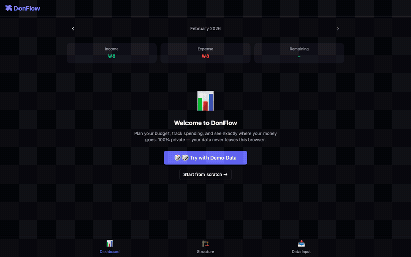

# DonFlow 💰

    [](https://dev.to/maxxmini/i-built-a-budget-app-with-zero-ai-zero-backend-zero-tracking-heres-why-58m9)

**You made a budget once. Then life happened — and the spreadsheet stayed frozen while your money didn't.**

DonFlow shows you exactly where your plan and reality diverge. Browser-only. No server. No signup. No tracking. Your financial data never leaves your machine.

🔗 **[Try it live →](https://maxmini0214.github.io/donflow/)**  
🎲 Click **"Try Demo Data"** on the dashboard to explore with sample transactions.



## Why DonFlow?

Most budget apps track what you *spent*. DonFlow tracks what you *planned* — and shows you where reality diverges. It's for people who *want* a budget structure but find spreadsheets too tedious to maintain.

- 📊 **Plan vs. Actual Dashboard** — Progress bars show budget vs. real spending per category
- ⚠️ **Drift Warnings** — Get alerted when spending exceeds your plan
- 🔮 **What-If Simulator** — Test budget changes before committing
- 💳 **Smart Import** — Upload bank/card CSV or XLSX files (auto-detects columns from any bank)
- 🏷️ **Custom Categories** — Organize with emoji labels and flexible grouping
- 📦 **Export/Import** — Full data backup as JSON
- ⌨️ **Keyboard Shortcuts** — Press `1`/`2`/`3` to switch tabs, `?` for shortcut reference
- 🔒 **100% Client-Side** — All data in IndexedDB. Zero network requests for your financial data.

## Privacy Promise

- **Zero network requests** — DonFlow makes no API calls, no analytics pings, no telemetry. Open DevTools and verify.
- **No accounts** — No signup, no login, no email collection.
- **Data stays in your browser** — Everything lives in IndexedDB on your machine. Close the tab and it's still there. Clear site data and it's gone. You're in control.
- **Open source** — Every line is auditable. MIT licensed.

## Data Portability

Your data is yours. Always.

- **Export anytime** — Full JSON backup with one click. Human-readable, well-structured JSON — open it in any text editor.
- **CSV export** — Transaction history as plain CSV. Import into Excel, Sheets, or any tool that reads tabular data.
- **No vendor lock-in** — Standard formats only. No proprietary schema, no binary blobs. Walk away whenever you want.
- **No account = no deletion risk** — There's no server to shut down, no company to go bankrupt, no subscription to cancel.
- **Can I read my data in 10 years?** — Yes. It's JSON and CSV. These formats will outlive us all.
- **What if you stop maintaining it?** — It's a static site with no server. It keeps working. Fork the repo and host it yourself. MIT licensed.
- **Works offline** — Once loaded, DonFlow works without internet. Your budget doesn't need WiFi.

## Why Not [X]?

| | DonFlow | Google Sheets | Mint/YNAB | Toss/Bank Apps |
|---|---|---|---|---|
| **Data location** | Your browser only | Google's servers | Their servers | Their servers |
| **Account required** | No | Google account | Yes | Yes |
| **Cost** | Free forever | Free | $99/yr+ | Free (limited) |
| **Plan vs. Reality** | ✅ Core feature | DIY formulas | Partial | ❌ |
| **Auto drift alerts** | ✅ Built-in | ❌ Manual | Partial | ❌ |
| **Bank/card import** | CSV/XLSX upload | Copy-paste | Auto-sync | Auto |
| **Privacy** | Zero tracking | Google analytics | Analytics + ads | Bank data |
| **Open source** | ✅ MIT | ❌ | ❌ | ❌ |

DonFlow is for people who want to **design their financial structure** — not just record what happened.

## Searching for Alternatives?

If you're looking for a **YNAB alternative**, **Mint alternative**, or **Toss alternative** that doesn't require a subscription, account, or handing over your bank credentials — DonFlow might be what you need.

- **Tired of YNAB's $99/year?** → DonFlow is free forever, open source, and runs entirely in your browser.
- **Miss Mint?** → DonFlow gives you plan-vs-actual tracking without the ads, analytics, or Intuit ecosystem.
- **Want more than Toss/bank apps?** → DonFlow lets you *design* your budget structure, not just view transactions.
- **Privacy-conscious?** → Zero network requests. Zero tracking. Your data never leaves your machine. [Verify it yourself.](https://maxmini0214.github.io/donflow/)

DonFlow works as a **Google Sheets budget template alternative** too — with auto-import, drift alerts, and what-if simulation built in.

## Quick Start

1. Visit [DonFlow](https://maxmini0214.github.io/donflow/)
2. Click **🎲 Try Demo Data** to see the dashboard in action
3. Or set up your own: define income & budget categories → upload transactions → watch plan vs. actual update live

## Tech Stack

- **React + TypeScript + Vite**
- **Dexie.js** (IndexedDB wrapper)
- **SheetJS** for CSV/XLSX parsing
- **GitHub Pages** for hosting

## Architecture

DonFlow follows a strict **zero-network, browser-only** architecture.

```
┌─────────────────────────────────────────┐
│  Browser (your machine)                 │
│                                         │
│  ┌──────────┐  ┌──────────────────────┐ │
│  │ React UI │←→│ Dexie.js (IndexedDB) │ │
│  └────┬─────┘  └──────────────────────┘ │
│       │                                 │
│  ┌────┴─────┐  ┌──────────────────────┐ │
│  │ SheetJS  │  │ Export Engine (JSON)  │ │
│  │ (import) │  │ (backup/restore)     │ │
│  └──────────┘  └──────────────────────┘ │
│                                         │
│  Network requests: 0                    │
│  Server dependencies: 0                 │
│  External APIs: 0                       │
└─────────────────────────────────────────┘
```

- **All computation happens client-side** — budget calculations, drift detection, what-if simulations
- **IndexedDB as the sole data store** — no localStorage fallback, no cookies, no server sync
- **Import pipeline** — SheetJS parses CSV/XLSX locally, auto-detects columns from any bank or card issuer (supports `$€£¥₩` amounts, accounting formats, and 14+ statement formats), maps to internal schema
- **No build-time secrets** — the deployed bundle contains zero API keys, tokens, or endpoints
- **Static hosting** — GitHub Pages serves pre-built assets. The "server" is a CDN. There is no backend to compromise.

Open DevTools → Network tab → use DonFlow for an hour → observe zero requests. That's the architecture.

## Contributing

See [CONTRIBUTING.md](CONTRIBUTING.md) for guidelines.

## Development

```bash
npm install
npm run dev
```

## License

MIT
