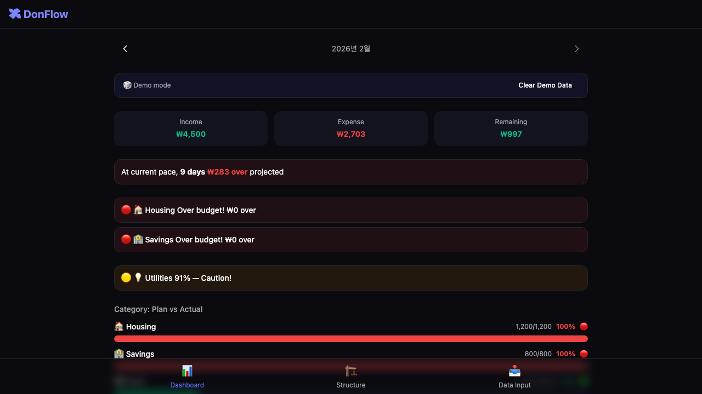

# DonFlow 💰

   

**A browser-only budget planner that compares plans vs. reality.**

> No server. No signup. No tracking. Your financial data never leaves your browser.

🔗 **[Try it live →](https://maxmini0214.github.io/donflow/)**  
🎲 Click **"Try Demo Data"** on the dashboard to explore with sample transactions.



## Why DonFlow?

Most budget apps track what you *spent*. DonFlow tracks what you *planned* — and shows you where reality diverges.

- 📊 **Plan vs. Actual Dashboard** — Progress bars show budget vs. real spending per category
- ⚠️ **Drift Warnings** — Get alerted when spending exceeds your plan
- 🔮 **What-If Simulator** — Test budget changes before committing
- 💳 **Smart Import** — Upload bank/card CSV or XLSX files (auto-detects 14+ card formats)
- 🏷️ **Custom Categories** — Organize with emoji labels and flexible grouping
- 📦 **Export/Import** — Full data backup as JSON
- 🔒 **100% Client-Side** — All data in IndexedDB. Zero network requests for your financial data.

## Privacy Promise

- **Zero network requests** — DonFlow makes no API calls, no analytics pings, no telemetry. Open DevTools and verify.
- **No accounts** — No signup, no login, no email collection.
- **Data stays in your browser** — Everything lives in IndexedDB on your machine. Close the tab and it's still there. Clear site data and it's gone. You're in control.
- **Open source** — Every line is auditable. MIT licensed.

## Quick Start

1. Visit [DonFlow](https://maxmini0214.github.io/donflow/)
2. Click **🎲 Try Demo Data** to see the dashboard in action
3. Or set up your own: define income & budget categories → upload transactions → watch plan vs. actual update live

## Tech Stack

- **React + TypeScript + Vite**
- **Dexie.js** (IndexedDB wrapper)
- **SheetJS** for CSV/XLSX parsing
- **GitHub Pages** for hosting

## Contributing

See [CONTRIBUTING.md](CONTRIBUTING.md) for guidelines.

## Development

```bash
npm install
npm run dev
```

## License

MIT
